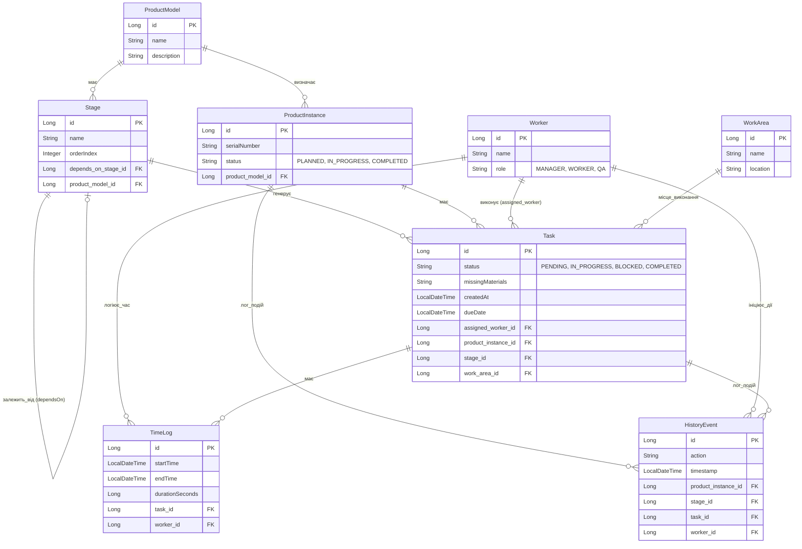

# Архітектура та UML Діаграми Проєкту (Production MVP)

Цей документ містить ключові діаграми, що описують загальну архітектуру застосунку та структуру бази даних.

## 1. Архітектура Системи (System Architecture)

Система складається з Frontend (на Vanilla JS/HTML/CSS), розміщеного на Vercel, та Backend (на Spring Boot), розміщеного на Render. Як сховище даних використовується зовнішня хмарна база PostgreSQL (Neon).

```mermaid
graph TD
    Client[Користувач / Браузер] -->|HTTP запити (CORS)| Frontend[Frontend (Vercel)]
    Frontend -->|REST API (JSON)| Backend[Backend (Render - Spring Boot)]
    
    subgraph Cloud Infrastructure
        Backend -->|JDBC| DB[(PostgreSQL - Neon)]
    end
    
    classDef client fill:#f9f,stroke:#333,stroke-width:2px;
    classDef cloud fill:#bbf,stroke:#333,stroke-width:2px;
    class Client client;
    class Backend,DB cloud;
```

## 2. Діаграма Сутностей Бази Даних (ER Diagram)

Основні моделі даних (Entity) та зв'язки між ними:


